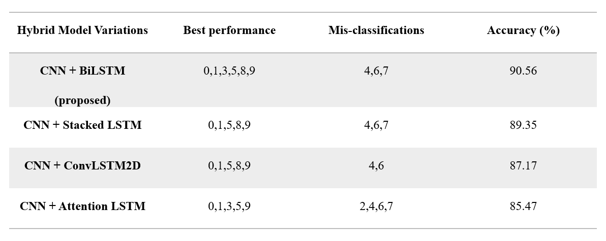

# From Gestures to Digits: A Real-Time Sign Language Recognition Pipeline Using CNN + LSTM Variants

**Team Members: Rohini H, Abhineswari M, Yazhini R (Vellore Institute of Technology)**

Sign language recognition is a key technology to improve communication accessibility for the speech and hearing impaired. This paper introduces a real-time sign language digit recognition system based on four hybrid deep learning models: 
- CNN + BiLSTM
- CNN + Stacked LSTM
- CNN + ConvLSTM2D, 
- CNN + Attention LSTM. 

The system utilizes Mediapipe for effective hand landmark detection, facilitating spatial and temporal feature extraction from keypoints without incurring the overhead of bounding box detection. Each model is trained and tested on a publicly available American Sign Language (ASL) digits dataset that contains images of static hand poses (digits 09) from a variety of participants. Our experiments show that the 
CNN + BiLSTM model performs better than other architectures:

<p align="center">
    
</p>

Although all models have good recognition performance for digits such as 0, 1, 5, and 9, misclassifications are more significant in gestures with visual similarity or 
overlapping features, especially digits 4, 6, and 7. The experiments show the efficacy of combining spatial and temporal learning for gesture-based communication and provide insights into how to optimize hybrid deep learning models for robust, real-time sign language recognition. 

## Proposed Architecture

The diagram below illustrates our ASL Digit Recognition pipeline.
<p align="center">
    
</p>

## Dataset 

We have used the 'Sign Language Digits Dataset by Turkey Ankara Ayrancı Anadolu High School Students'
Clone the repository by using the url: https://github.com/ardamavi/Sign-Language-Digits-Dataset.git

The diagram below illustrates a referenceas it contains 2,060 images in total. Each digit (0-9) has approximately 205 samples.
<p align="center">
    
</p>

### Prerequisites

**Install dependencies**:
```bash
pip install -r requirements.txt
```

**Dataset and file Setup**:
- Organize your data in the format expected by `Dataset' (each class in its own folder) by https://github.com/ardamavi/Sign-Language-Digits-Dataset.git.
  
- Update the .py files `Keypoints_Hybrid_BiLSTM`, `Keypoints_Stacked LSTM`, `Keypoints_ConvLSTM2D`,`Keypoints_AttentionLSTM` with your dataset path: `data_dir = "path/to/data/dir"`.


## Working structure of the code
- **`Keypoints_Hybrid_BiLSTM`**, **`Keypoints_Stacked LSTM`**, **`Keypoints_ConvLSTM2D`**,**`Keypoints_AttentionLSTM`**:
  
These files have the implementation as follows
- Load and pre-process the dataset
- Extract the Keypoints using MediaPipe Hand points
- Plot the Extracted Keypoints for the hand signs
- Build and define the parameters of the model
- Train it after spilting for validation and testing
- Save the model
- Real time detection and recognition using webcam


